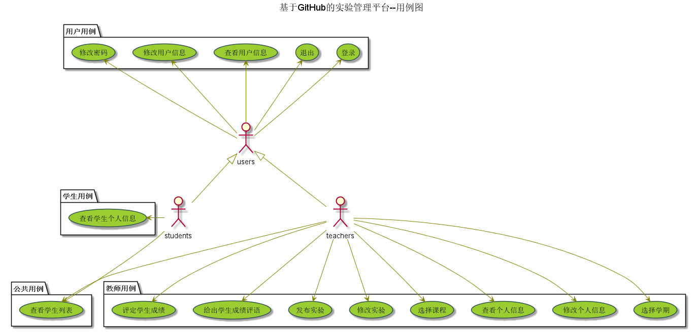

# 实验六：基于GitHub的实验管理平台的分析与设计
|学号|班级|姓名|
|:-------:|:-------------: | :----------:|
|201510414124|软件(本)15-1|熊峰|

## 1. 概述
- 基于GitHub的实验管理平台的作用是在线管理实验成绩的Web应用系统。学生和老师的实验内容均存放在GitHUB页面上。
- 学生的功能主要有：一是设置自己的GitHub用户名，二是查询自己的实验成绩。学生的GitHub用户名是公开的，但成绩不公开。
- 老师的功能主要有：一是批改每个学生的成绩，二是查看每个学生的成绩，三是可以发布实验，四是可以选择学期进行管理。
- 老师和学生都能通过本系统的链接方便地跳转到学生的每个GitHUB实验目录，以便批改实验或者查看实验情况。
- 实验成绩按数字分数计算，每项实验的满分为100分，最低为0分。
- 系统自动计算每个学生的所有实验的平均分。
    
## 2. 系统总体结构

界面设计参见：https://crazyxfeng.github.io/is_analysis/test6/ui/主界面.html
    
## 3. 用例图设计 [源码](src/usecase.puml)

## 4. 类图设计 [源码](src/class.puml)

## 5. 数据库设计
- ### [参见数据库设计](./数据库设计.md)

## 6. 用例及界面详细设计
- ### [“修改用户信息”用例](./用例/修改用户信息.md),[界面](https://crazyxfeng.github.io/is_analysis/test6/ui/修改个人信息.html)
-  ### [“发布实验”用例](./用例/发布实验.md),[界面](https://crazyxfeng.github.io/is_analysis/test6/ui/发布实验.html)
- ### [“学生列表”用例](./用例/学生列表.md),[界面](https://crazyxfeng.github.io/is_analysis/test6/ui/主界面.html)
- ### [“学生界面”用例](./用例/学生界面.md),[界面](https://crazyxfeng.github.io/is_analysis/test6/ui/学生界面.html)
- ### [“教师界面”用例](./用例/教师界面.md),[界面](https://crazyxfeng.github.io/is_analysis/test6/ui/教师界面.html)
- ### [“查看实验要求”用例](./用例/查看实验要求.md),[界面](https://crazyxfeng.github.io/is_analysis/test6/ui/查看实验-学生.html)
- ### [“查看成绩”用例](./用例/查看成绩.md),[界面](https://crazyxfeng.github.io/is_analysis/test6/ui/查看成绩.html)
- ### [“查看所有实验”用例](./用例/查看所有实验.md),[界面](https://crazyxfeng.github.io/is_analysis/test6/ui/全部实验.html)
- ### [“查看用户信息”用例](./用例/查看用户信息.md),[界面](https://crazyxfeng.github.io/is_analysis/test6/ui/查看用户信息.html)
- ### [“登录”用例](./用例/登录.md),[界面](https://crazyxfeng.github.io/is_analysis/test6/ui/登录.html)
- ### [“评定成绩”用例](./用例/评定成绩.md),[界面](https://crazyxfeng.github.io/is_analysis/test6/ui/评定成绩.html)
- ### [“退出”用例](./用例/退出.md),[界面](https://crazyxfeng.github.io/is_analysis/test6/ui/退出.html)

    
