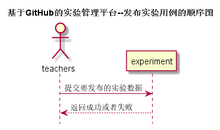

# “发布实验”用例 [返回](../README.md)
## 1. 用例规约

|用例名称|发布实验|
|-------|:-------------|
|功能|教师在平台上发布实验要求|
|参与者|老师|
|前置条件|老师必须先登录后，并且点击”发布实验“进入到页面|
|后置条件||
|主事件流| 1.教师填写实验标题   2.填写开始时间和结束时间  3.教师填写实验内容  4.点击”发布“|
|备选事件流|a. 实验标题为空  &nbsp;&nbsp; 1.系统提示实验标题不能为空    b. 实验内容为空  &nbsp;&nbsp; 1.系统提示实验内容不能为空    c. 实验标题截止日期在发布日期之前  &nbsp;&nbsp; 1.系统提示实验截止日期不合格   &nbsp;&nbsp; |

## 2. 业务流程 [源码](../src/发布实验.puml)
 

## 3. 界面设计
- 界面参照: https://github.com/crazyxFeng/is_analysis/test6/ui/发布实验.html
- API接口调用
    - 接口1：[setPassword](../接口/release_experiment.md)

## 4. 算法描述 
无
    
## 5. 参照表
- [EXPERIMENT](../数据库设计.md/#USERS)